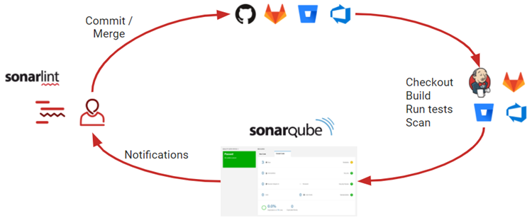

# SonarLint와 SonarQube의 목적과 역할

## 1. SonarLint란?

### 역할:
IDE에서 실시간 코드 분석을 통해 코드 품질을 관리하고, 개발 중 발생할 수 있는 문제를 즉시 확인하여 빠르게 수정하도록 돕는 도구.

### 사용 목적:
- 개발 중 **실시간으로 문제를 발견**하고, 코드 품질을 높이기 위해 사용.
- 버그, 보안 취약점, 코드 냄새 등을 IDE 내부에서 즉시 파악 가능.
- **CI/CD 파이프라인 이전에**, 개발자가 코드를 사전에 개선할 수 있음.

## 2. SonarQube란?

### 역할:
서버에서 코드베이스 전체를 분석하여, **장기적인 코드 품질 관리**를 목표로 하는 도구. **CI/CD 파이프라인에 통합**되어 팀 전체의 코드 품질을 지속적으로 관리함.

### 사용 목적:
- 프로젝트 전체의 **코드 품질을 관리**하고, 팀 전체의 **통일된 품질 기준**을 제공.
- 프로젝트의 **기술 부채**를 줄이고, 장기적인 코드 유지보수성을 확보하기 위해 사용.
- **CI/CD 파이프라인과 연동**해 코드 배포 전 품질 검사를 보장.

---

# 왜 SonarLint와 SonarQube를 사용해야 하는가?

| **사용 이유**                | **SonarLint**                                           | **SonarQube**                                              |
|----------------------------|--------------------------------------------------------|------------------------------------------------------------|
| **즉각적인 문제 발견**        | 개발자가 **코드 작성 중 실시간으로 문제**를 확인하고 수정 가능  | 코드가 **배포되기 전에 CI/CD에서 전체 프로젝트**에 대해 분석 |
| **장기적 코드 품질 관리**      | 로컬에서 실시간으로 문제를 사전에 해결하여 프로젝트 품질에 기여    | **전체 프로젝트의 코드 품질을 분석**하고, 팀 전체의 품질 기준을 설정 |
| **보안 및 코드 냄새 감지**    | 코드의 **버그, 보안 취약점, 코드 냄새** 등을 IDE에서 바로 확인 가능 | **보안 취약점과 기술 부채**를 줄이고, 장기적으로 유지보수가 용이한 코드베이스 확보 |
| **팀 협업**                 | 팀원들이 같은 규칙을 적용하여 **일관성 있는 코드** 작성 가능      | CI/CD에서 코드 품질을 관리하고, 팀 전체가 **통일된 기준**을 사용 가능 |


---

# SonarLint와 SonarQube 사용 흐름

## 1. SonarLint를 이용한 로컬 코드 분석
- 개발자는 **IntelliJ IDEA**에서 **SonarLint**를 설치하여 실시간 코드 분석을 시작합니다.
- 코드 작성 중 **SonarLint**가 자동으로 분석을 진행하고, **IDE에서 즉시 문제 경고**를 표시합니다.
- 개발자는 경고를 확인하고, **즉시 수정**하여 코드 품질을 높입니다.

## 2. 코드 커밋 및 CI/CD 파이프라인 통합
- 개발이 완료되면 **Git**을 사용해 코드를 커밋하고 푸시합니다.
- **CI/CD 파이프라인**이 트리거되어 SonarQube 서버에서 **전체 프로젝트의 코드 품질을 분석**합니다.

## 3. SonarQube에서 프로젝트 전체 코드 품질 분석
- SonarQube는 전체 코드베이스를 스캔하고, **버그, 보안 문제, 코드 냄새**를 포함한 여러 품질 지표를 분석합니다.
- 분석 결과는 **SonarQube 대시보드**에서 확인할 수 있으며, 팀원들이 분석 결과를 검토할 수 있습니다.

## 4. 팀 협업 및 코드 품질 개선
- 팀원들이 SonarQube 대시보드를 통해 **코드 리뷰**를 진행하고, 문제를 해결합니다.
- SonarQube는 **코드 품질 기준을 통합**적으로 제공하여 팀 전체가 동일한 규칙을 적용할 수 있도록 돕습니다.

---

# SonarLint와 SonarQube 설정 방법

## 1. SonarLint 설치 및 설정 방법

IntelliJ IDEA에서 SonarLint를 설치하는 방법은 다음과 같습니다:

1. IntelliJ IDEA에서 **`File > Settings > Plugins`**으로 이동.
2. **SonarLint**를 검색하고, 설치 후 **IDE 재시작**.
3. 설치 후 IDE 상태바에 SonarLint가 활성화됨.
4. **로컬 분석**을 위해 코드 작성 중 자동으로 SonarLint가 분석을 시작하며, 문제를 발견하면 IDE에서 경고가 표시됩니다.
5. SonarQube와 **연동을 원할 경우**, SonarQube 서버 주소 및 인증 토큰을 설정하여 연동 가능.

## 2. SonarQube 설치 및 설정 방법

SonarQube 서버 설정은 다음과 같은 단계로 진행됩니다:

1. **SonarQube 서버를 로컬 또는 클라우드 환경에 설치**.
    - 서버 설치: [SonarQube 공식 문서](https://docs.sonarqube.org/latest/setup/get-started-2-minutes/) 참고.
2. **SonarQube 프로젝트 생성**:
    - SonarQube 대시보드에 접속하여 **새 프로젝트 생성** 후, 해당 프로젝트에 대한 분석 설정을 완료.
3. **CI/CD 파이프라인과 연동**:
    - **Jenkins, GitLab CI, GitHub Actions** 등과 SonarQube를 연동하여 **자동 분석**을 설정.
    - `.yml` 또는 **Jenkinsfile**에서 SonarQube 관련 플러그인을 추가하여 **파이프라인에 통합**.
4. **분석 결과 확인**:
    - 코드 커밋 후 SonarQube가 자동으로 코드를 분석하며, 결과는 대시보드에서 확인 가능.
5. **규칙 설정 및 관리**:
    - SonarQube에서 **품질 기준**과 **분석 규칙**을 설정하여 팀 전체가 동일한 기준을 따르도록 설정 가능.

## CI/CD 파이프라인과 SonarQube 연동 예시 (Jenkins):

```groovy
pipeline {
    agent any
    stages {
        stage('Checkout') {
            steps {
                git 'https://your-repo.git'
            }
        }
        stage('SonarQube Analysis') {
            steps {
                script {
                    def scannerHome = tool 'SonarQube Scanner'
                    withSonarQubeEnv('SonarQube') {
                        sh "${scannerHome}/bin/sonar-scanner"
                    }
                }
            }
        }
        stage('Quality Gate') {
            steps {
                timeout(time: 1, unit: 'HOURS') {
                    waitForQualityGate abortPipeline: true
                }
            }
        }
    }
}
전체 흐름 요약
SonarLint는 IDE에서 실시간 코드 품질 분석을 제공하고, SonarQube는 전체 프로젝트의 장기적인 품질 관리를 돕습니다.
SonarLint는 개발자가 코드를 작성할 때 실시간 피드백을 제공해 문제를 사전에 해결하고, SonarQube는 CI/CD 파이프라인과 연동되어 코드 배포 전에 품질 기준을 검증합니다.
팀 협업 시 SonarQube를 통해 통일된 품질 기준을 적용하며, SonarLint는 개발자가 로컬에서 품질을 미리 개선할 수 있도록 돕습니다.